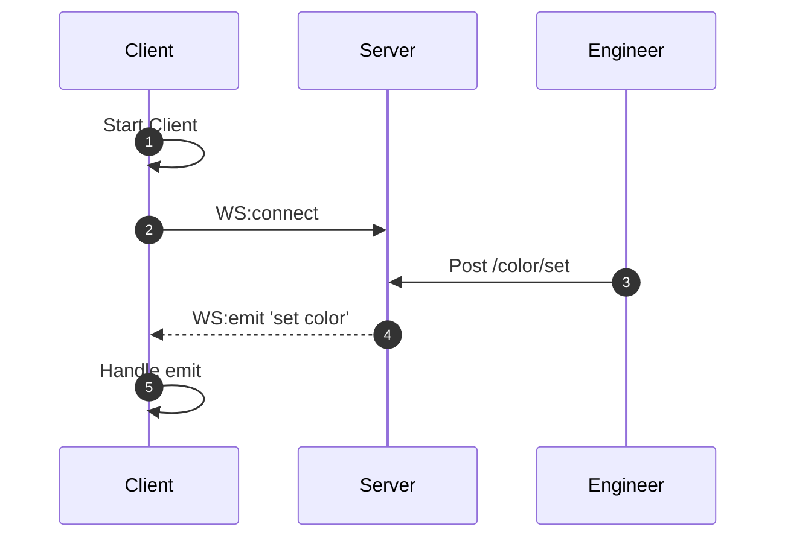

# Sockethouse
The training project on the topic of socket ws.
# Installation
    git clone https://github.com/GrigoriyMo/sockethouse.git myfolder
    cd myfolder
    npm install
    node index.js 

# Files

 - index.html (view and client code)
 - index.js (server code)
 - postman-collection/SocketHouse.postman_collection.json (Postman collection for turn on/off lamps)
 

## UML diagrams

